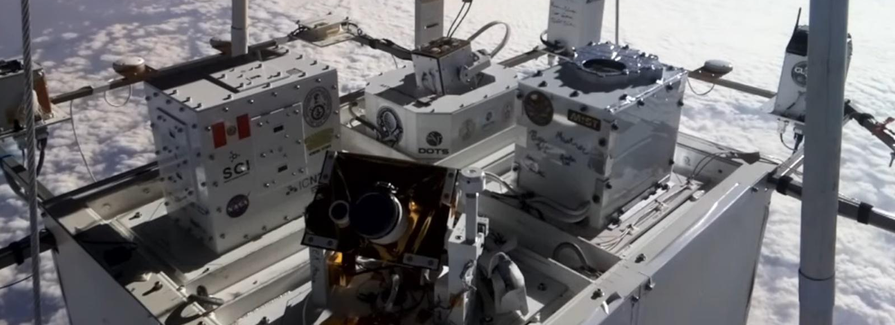

# On–Off Temperature Control System for the HELIOS HASP 2024 Payload

  

  <em>Stratospheric view of the HELIOS HASP UNI payload during high-altitude flight.</em>

## Overview
This repository contains the experimental and final implementation scripts for an on–off temperature control system developed for the payload flown in the HELIOS HASP 2024 project.   
The system was designed and validated within the Control and Electronics area of the payload, with the primary objective of ensuring thermal stability during a high-altitude stratospheric balloon mission.
The HELIOS project was conceived to study the behavior and performance of perovskite solar cells under stratospheric environmental conditions. At altitudes above 30 km, electronic systems are exposed to extreme thermal gradients, low atmospheric pressure, and intense solar radiation. Under these conditions, temperature regulation becomes critical to preserve sensor accuracy, ensure repeatable measurements, and maintain the operational integrity of the onboard electronics throughout the mission.

## Scientific Context

The High Altitude Student Platform (HASP) is an educational and research initiative that enables undergraduate students to design, integrate, and fly scientific and technological experiments at near-space altitudes using a zero-pressure balloon system. Operated by the NASA Balloon Program Office through the Columbia Scientific Balloon Facility and funded by the State of Louisiana and the Louisiana Space Consortium, HASP can carry up to twelve student payloads to altitudes of approximately 36 km for flights lasting 15–20 hours. The platform provides a robust structural framework, standardized power and communication interfaces, and a centralized command-and-control architecture—comprising the FCU, DAU, and SCU—supported by Ethernet-based networking, distributed sensing, and modular electronics mounting, thereby offering a reliable and flexible environment for high-altitude experimental validation.

## Methods
On–off control is one of the simplest and most robust control strategies for embedded systems implemented on microcontrollers. The control action is based on a binary decision: the actuator is fully activated when the measured variable is below a reference threshold and deactivated when it exceeds that threshold. Due to its simplicity, low computational cost, and high reliability, on–off control is widely used in thermal regulation applications where strict precision is not required but robustness is essential.

## System Description
The implemented system is a closed-loop temperature control system. A reference temperature is defined, and the actual temperature is measured using a thermocouple interfaced through a MAX31865 signal conditioning sensor. The sensor is connected to an ESP32 microcontroller, which executes the control logic. Based on the temperature error relative to the reference, the ESP32 activates or deactivates a set of heating pads that act as thermal actuators. These heating elements are driven through a power driver stage, allowing the system to maintain the payload temperature within an acceptable operating range during laboratory testing and simulated flight conditions.

## Results
- Initial laboratory tests were conducted using a fuzzy logic temperature control strategy. A reference temperature of 45 °C was established, and stable temperature regulation was achieved. However, the settling time of the fuzzy controller was excessively long for the intended application.
- As a result, an on–off control strategy was adopted. A new reference temperature of 25 °C was selected, and the on–off controller demonstrated improved performance, achieving faster settling times and more efficient temperature regulation under laboratory conditions. These results justified the selection of the on–off control approach for the final payload implementation.

## Repository Structure
- `code/`: final firmware and experimental scripts written in C for STM32 microcontroller cores
- `datasheets/`: datasheets for sensors, microcontrollers, and communication modules
- `documentation/`: technical documentation describing sensor operation, hardware configuration, and firmware usage
- `leagcy/`: early experimental scripts and preliminary development versions
- `libraries/`: fuzzy control and sensor interface libraries used during development
- `papers/`: reference articles and technical papers reviewed during the project
- `pinout/`: verified pinout diagrams for the employed STM32 NUCLEO boards
- `results/`: experimental results obtained from temperature control tests and data acquisition

## Hardware Setup
- STM32 NUCLEO-F446RE
- STM32 NUCLEO-L432KC
- Heating pads
- L298N driver module
- Arduino development boards
- ESP32 development board
- Adafruit MAX31865 with thermocouple
- Laboratory power supply (12 V, 3 A)
- Digital multimeter

## Requirements
- **IDEs**:
  - STM32CubeIDE
  - Arduino IDE

- **Programming Languages**:
  - C
  - C++

- **Libraries**:
  - MAX31865 sensor library

## Key Resources and Links

1. **StratoCat – High-Altitude Balloon Flight Database**  
   Public database providing detailed documentation, imagery, and metadata of
   scientific high-altitude balloon missions, including the HASP 2024 flight.
   Image used in this repository was sourced from the corresponding mission page.  
   https://stratocat.com.ar/fichas-e/2024/FSU-20240904.htm

## Author
**David Fernando Evangelista Cuti** 
National University of Engineering (UNI), Peru
